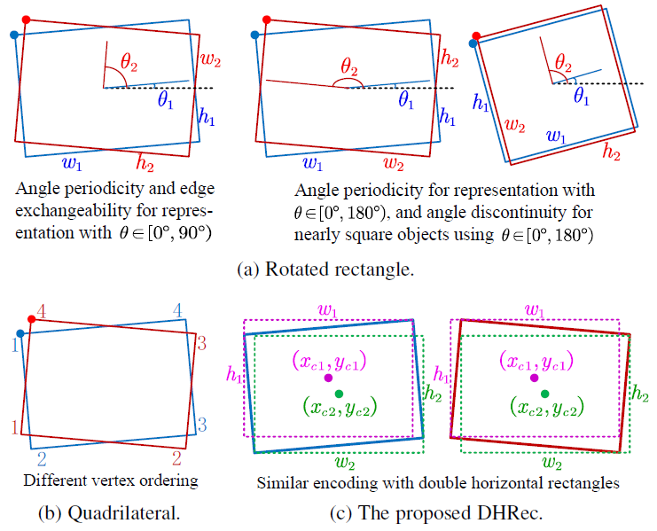

### Multi-Oriented Object Detection in Aerial Images with Double Horizontal Rectangles



> **[Multi-Oriented Object Detection in Aerial Images with Double Horizontal Rectangles](#)**,            
> Guangtao Nie, Hua Huang, TPAMI.

The repo is based on an older [MMDetection](https://github.com/open-mmlab/mmdetection) **version 2.3.0**.
MMDetection is an open source object detection toolbox based on PyTorch. It is
a part of the OpenMMLab project developed by [Multimedia Laboratory, CUHK](http://mmlab.ie.cuhk.edu.hk/).

The master branch works with **PyTorch 1.3 to 1.6**.
We modify and improve the original version to adapt to multi-oriented objects.
The released codes are refered from other similar repos 
[AerialDetection](https://github.com/dingjiansw101/AerialDetection) and
[S2ANet](https://github.com/csuhan/s2anet).

The more simple repo based on [MMRotate](https://github.com/open-mmlab/mmrotate) project is coming soon.

### Introduction
Most existing methods adopt the quadrilateral or rotated rectangle representation to detect multi-oriented objects. Yet, the same oriented object may correspond to several different representations, due to different vertex ordering, or angular periodicity and edge exchangeability. To ensure the uniqueness of the representation, some engineered rules are usually added. This makes these methods suffer from discontinuity problem, resulting in degraded performance for objects around some orientation. In this paper, we propose to encode the multi-oriented object with double horizontal rectangles (DHRec) to solve the discontinuity problem. Specifically, for an oriented object, we arrange the horizontal and vertical coordinates of its four vertices in left-right and top-down order, respectively. The first (resp. second) horizontal box is given by two diagonal points with smallest (resp. second) and third (resp. largest) coordinates in both horizontal and vertical dimensions. We then regress three factors given by area ratios between different regions, helping to guide the oriented object decoding from the predicted DHRec. Inherited from the uniqueness of horizontal rectangle representation, the proposed method is free of discontinuity issue, and can accurately detect objects of arbitrary orientation. Extensive experimental results show that the proposed method significantly improves the existing baseline representation, and outperforms state-of-the-art methods.


## Benchmark and model zoo

* **DOTA 1.0**

|Model                      |train | val |    Backbone     |    MS  |  Rotate | Lr schd  | box AP | Download|
|:-------------:            |:-----|----:| :-------------: | :-----:| :-----: | :-----:  | :----: | :---------------------------------------------------------------------------------------: |
|ATSS-Rotated(5)                      |train | val      |    Res50     |  [0.5,1]   |   -    |   1x     |  69.51 |    [cfg](configs/atss/atss_r50_fpn_1x_baseline_five_params_dota.py) [model](#) [log](#) |
|ATSS-Rotated(8)                      |train | val      |    Res50     |  [0.5,1]   |   -    |   1x     |  69.40 |    [cfg](configs/atss/atss_r50_fpn_1x_baseline_five_params_dota.py) [model](#) [log](#) |
|ATSS-DHRec                      |train | val      |    Res50     |  [0.5,1]   |   -    |   1x     |  74.10 |    [cfg](configs/atss/atss_r50_fpn_1x_dhrec_dota.py) [model](#) [log](#) |
|ATSS-Rotated                      |train+val | test      |    Res50     |  [1]   |   ✓    |   2x     |  71.19 |    [cfg](configs/atss/atss_r50_fpn_2x_baseline_five_params_dota.py) [model](#) [log](#) |
|ATSS-DHRec                      |train+val | test      |    Res50     |  [1]   |   ✓    |   2x     |  74.57 |    [cfg](configs/atss/atss_r50_fpn_2x_dhrec_dota.py) [model](#) [log](#) |
|ATSS-Rotated                      |train+val | test      |    Res50     |  [0.5,1,1.5]   |   ✓    |   1x     |  76.64 |    [cfg](configs/atss/atss_r50_fpn_2x_baseline_five_params_dota_multi.py) [model](#) [log](#) |
|ATSS-DHRec                      |train+val | test      |    Res50     |  [0.5,1,1.5]   |   ✓    |   1x     |  78.97 |    [cfg](configs/atss/atss_r50_fpn_2x_dhrec_dota_multi.py) [model](#) [log](#) |


**Note:**
1. All our models are trained on 2 GPUs (4 images per GPU) with the learning rate 0.01.
2. The checkpoints will be here soon.

## Installation

Please refer to [install.md](docs/install.md) for mmdetection installation and dataset preparation.

Alter installing mmdetection, DOTA_KIT installation is also required, please refer to [readme.md](mytools/dota_kit/readme.md) for the installation.


## Getting Started

Please see [getting_started.md](docs/getting_started.md) for the basic usage of MMDetection.
We provide [colab tutorial](demo/MMDet_Tutorial.ipynb) for beginners.
There are also tutorials for [finetuning models](docs/tutorials/finetune.md), [adding new dataset](docs/tutorials/new_dataset.md), [designing data pipeline](docs/tutorials/data_pipeline.md), and [adding new modules](docs/tutorials/new_modules.md).

For trouble shooting, please refer to [trouble_shooting.md](docs/trouble_shooting.md)


## Citation

```
@inproceedings{nie2022DHRec,
  author = {Nie, Guangtao and Huang, Hua},
  title = {Multi-Oriented Object Detection in Aerial Images with Double Horizontal Rectangles},
  booktitle = {IEEE Trans. Pattern Analysis and Machine Intelligence (TPAMI)},
  year = {2022}
}
```